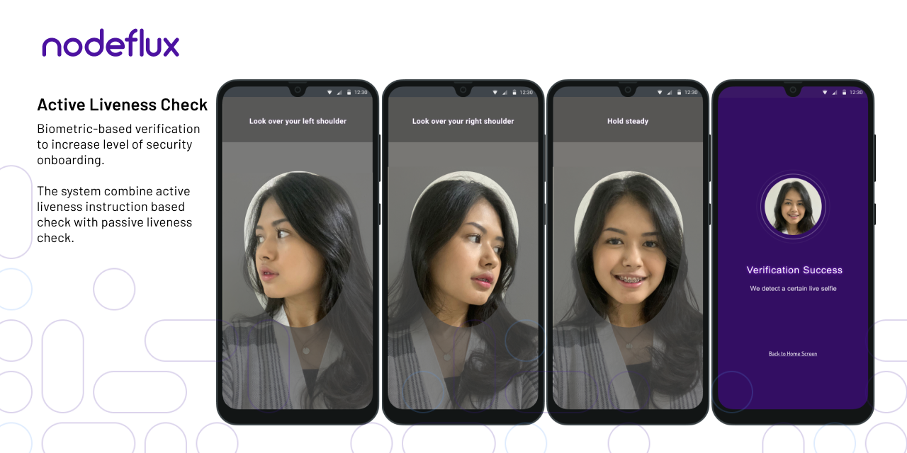

<p align="center">

</p>

# Nodeflux iOS Face Liveness SDK

## Authenticate Your Customer's Face Liveness

Take advantage of our iOS SDK to authenticate your client's facial liveness. With a combination of active and passive liveness technology, protect your application/business from attempted falsification of client data.

This SDK provides some sets of activities to check the selfie is spoofed or real for the purpose of biometric verification. The SDK gives you some benefits to create better onboarding flow during the verification process, such as:
1. Double spoof checking by performing AI model combination of active liveness process and passive liveness.

2. Carefully designed simple UI to guide your customers to perform motion checking for preventing liveness attacks.

3. Secure the spoofing activity by filtering artificial input such as masks, print attacks, and replay attacks.

<a href="https://www.identifai.id/face-liveness-detection"><button class="btn btn-secondary">Learn More</button></a>

## Getting the SDK

The best way to get the Nodeflux iOS Liveness SDK is to use CocoaPods. If you don't already use CocoaPods, the <a target="out" href="http://guides.cocoapods.org/using/getting-started.html">CocoaPods Getting Started Guide</a> will have you managing dependencies in no time.

Add Button to your target by adding the following line to your `Podfile`.

```
pod 'LivenessSDK', git: 'https://github.com/nodefluxio/ios-sdk-face-liveness.git', tag: '1.2.0'
```

Alternatively, you can download the [latest iOS Liveness framework](https://github.com/nodefluxio/ios-sdk-face-liveness/releases/latest) and add xcframework file to your current project.

## Getting Started

1. Get a Nodeflux Credential (Access Key and Secret Ket) by using this step: [docs.identifai.id](https://docs.identifai.id/api-documentation/get-access-key)

2. Follow the [Integration Guide](https://docs.identifai.id/sdk-documentation/active-liveness-ios-sdk/beta-active-liveness-ios-sdk-basic-implementation)

<!-- ## Going Live

Before you submit to the App Store, follow the steps in the Identifai dashboard to get ready for using Nodeflux iOS Liveness SDK in production! -->

## Questions?

Ask us! Drop us an email at <a href="mailto:developer@nodeflux.io">developer@nodeflux.io</a> or submit issue to this github page, our developers will get in touch with you ASAP.